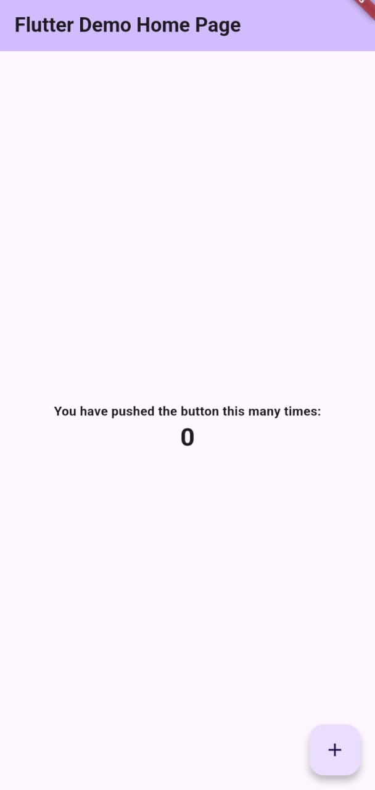
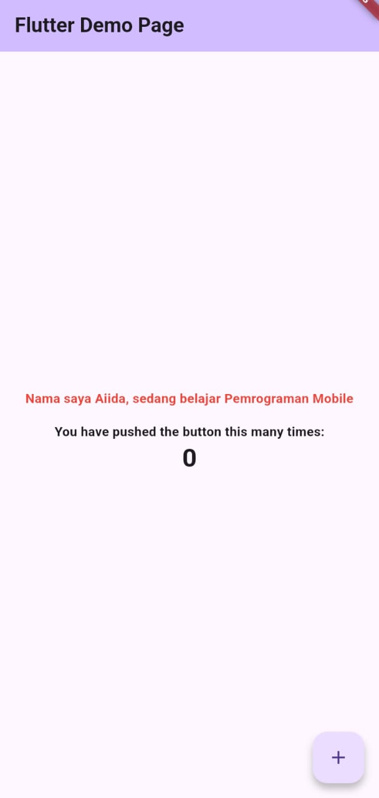
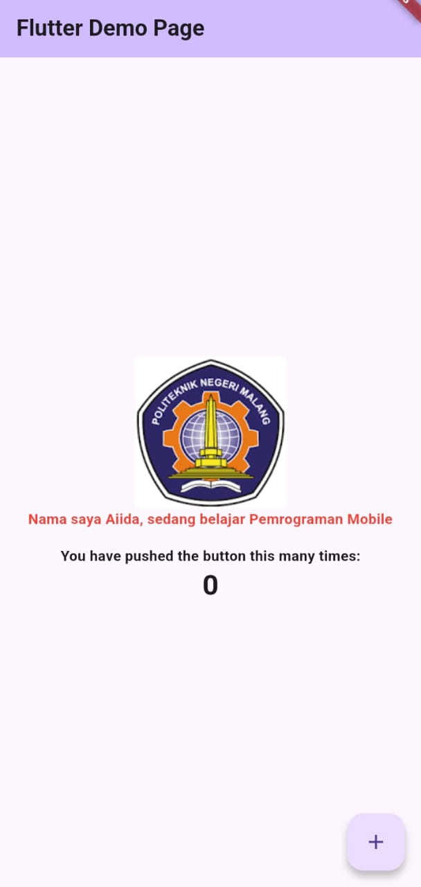
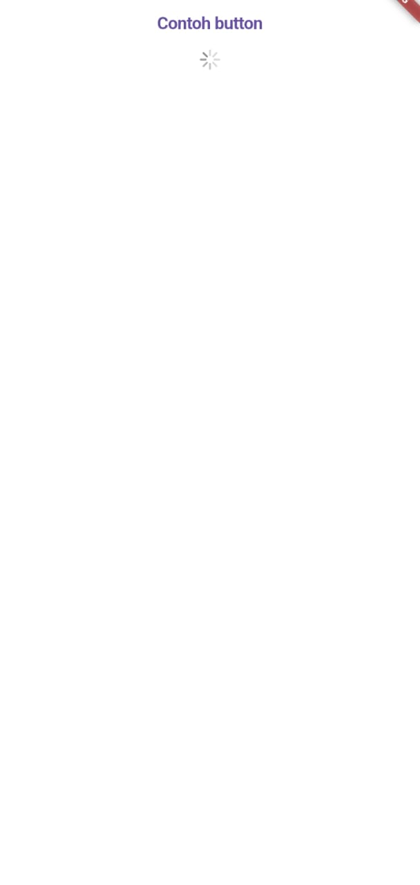
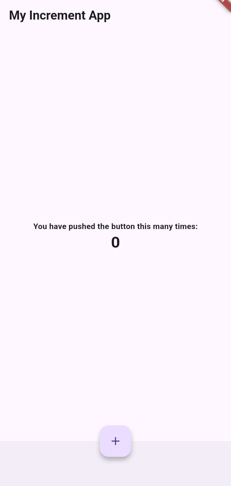
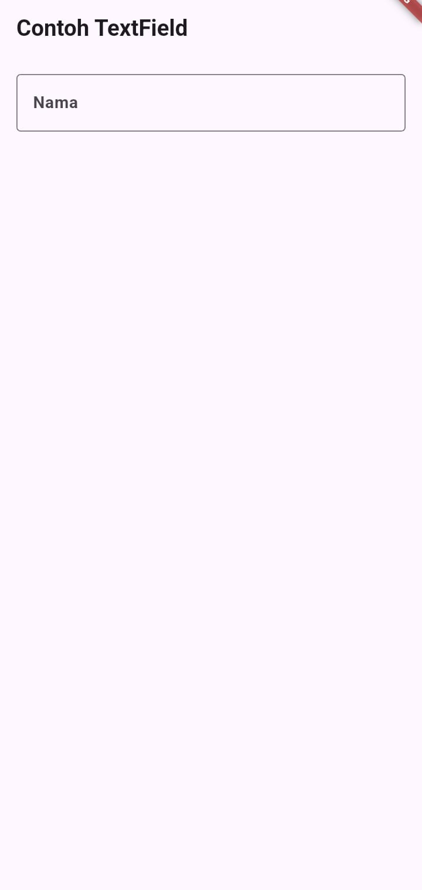
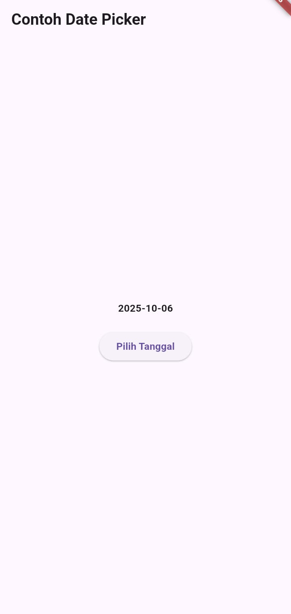

# hello_world

A new Flutter project.

Tahap awal dalam membuat proyek Flutter

Menambah kata dengan nama kita

Menambah logo polinema

Menampilkan indikator loading

Menampilkan tombol jempol merah

Tombol berbentuk lingkaran yang mengambang dan berfungsi sebagai tindakan utama, misalnya untuk menambah data

Komponen utama dalam aplikasi Flutter seperti AppBar, Body, FloatingActionButton, dan Drawer

Widget yang digunakan untuk menerima masukan dari pengguna seperti TextField, Checkbox, Radio, atau Dropdown

Widget untuk memilih tanggal dan waktu agar memudahkan pengguna dalam mengisi data waktu